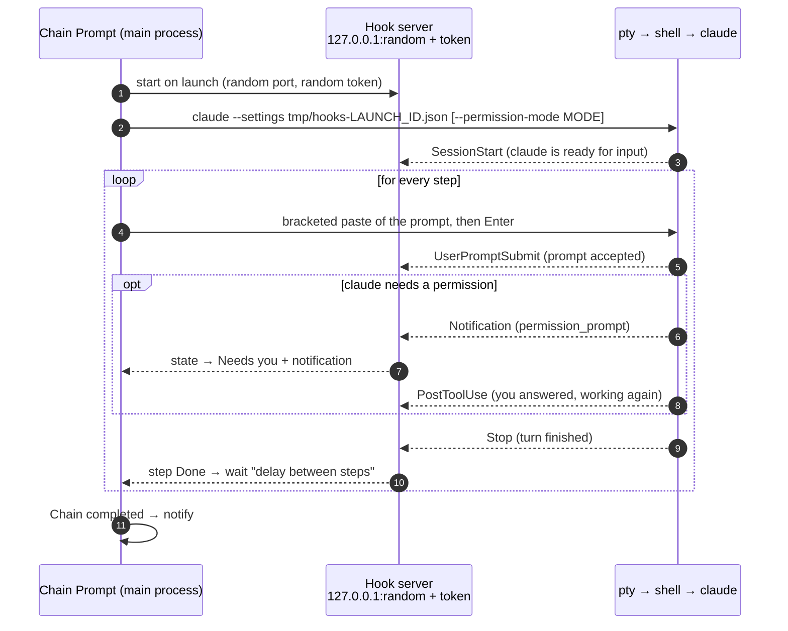
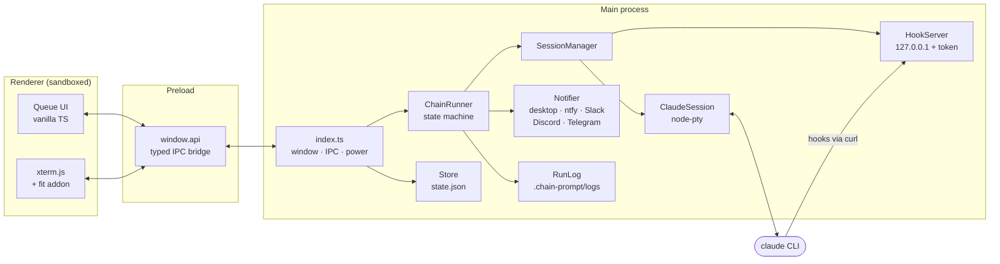
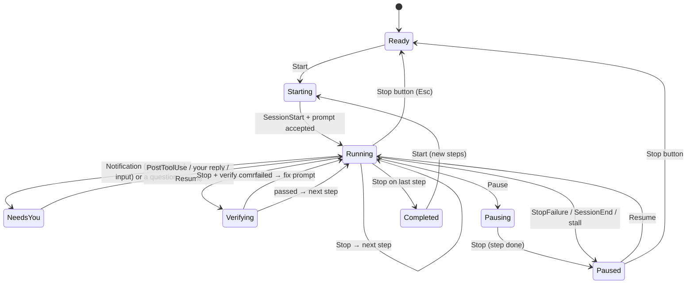

<div align="center">


# Chain Prompt

**Queue up a series of prompts for Claude Code and walk away.**
Chain Prompt feeds each prompt into the same interactive `claude` session the moment the previous one finishes.
It detects completion through Claude Code hooks, not by parsing terminal output.


<br />


<br />


**⬇ [Download for Windows](https://github.com/mehmetkahya0/chain-prompt/releases/latest/download/Chain-Prompt-Setup-x64.exe)** ·
**⬇ [macOS (Apple Silicon)](https://github.com/mehmetkahya0/chain-prompt/releases/latest/download/Chain-Prompt-mac-arm64.dmg)** ·
**⬇ [macOS (Intel)](https://github.com/mehmetkahya0/chain-prompt/releases/latest/download/Chain-Prompt-mac-x64.dmg)**

**▶ [Watch the 28-second promo](#promo-video)**

</div>

---

## Contents

- [Why](#why)
- [Features](#features)
- [Promo video](#promo-video)
- [Screenshots](#screenshots)
- [Download and install](#download-and-install)
  - [Windows](#windows)
  - [macOS](#macos)
- [Build from source](#build-from-source)
- [Usage](#usage)
- [Chain files (templates)](#chain-files-templates)
- [Step options](#step-options)
- [Variables and templates](#variables-and-templates)
- [Git checkpoints](#git-checkpoints)
- [Cost and run history](#cost-and-run-history)
- [Tabs, search, bulk actions and shortcuts](#tabs-search-bulk-actions-and-shortcuts)
- [Scheduling](#scheduling)
- [Headless CLI](#headless-cli)
- [Settings](#settings)
- [Notifications, sleep and logs](#notifications-sleep-and-logs)
- [How step completion is detected](#how-step-completion-is-detected)
- [Architecture](#architecture)
- [Cross-platform notes](#cross-platform-notes)
- [Testing](#testing)
- [Troubleshooting](#troubleshooting)
- [Known limitations](#known-limitations)
- [Scripts reference](#scripts-reference)
- [Publishing a release](#publishing-a-release)

## Why

Long Claude Code tasks often come as a sequence: *plan → implement → run tests → review → changelog*. Without
automation you have to sit at the terminal and type the next prompt each time a turn ends. Chain Prompt lets you
queue the whole sequence at once and go do something else. You get a notification when the chain finishes, when
claude needs a permission, or when something goes wrong.

It runs the real interactive `claude` inside a real pseudo-terminal, so you can watch, scroll, and type into the
session at any time, exactly as in your own terminal.

## Features

| | Feature | Details |
|---|---|---|
| 🔗 | **Hook-driven chaining** | Claude Code's `Stop` hook marks a step done. The next prompt is typed into the same session automatically. No screen scraping. |
| 🖥️ | **Real terminal** | xterm.js + node-pty running the interactive `claude`. Type in it, copy/paste, and it resizes with the panel. |
| 📋 | **Prompt queue** | Multi-line prompts, drag-and-drop reordering, edit, duplicate, delete, reset. Status is shown by colour and icon. |
| ⏯️ | **Full control** | Start, Pause (after the current step), Resume, Stop (interrupts claude with Esc), Skip next. |
| 🙋 | **Waits for you** | Permission prompts and input requests (`Notification` hook) switch the chain to *Needs you* and notify you. |
| 🧹 | **Fresh context per step** | Optional *new session* per step, via `/clear` or a full claude restart. |
| 🔐 | **Permission modes** | Default, `acceptEdits`, or `bypassPermissions` (with a risk warning), passed as `--permission-mode`. |
| 💾 | **Templates** | Save and load chains as JSON. The last queue is persisted automatically. |
| 🛟 | **Crash-safe** | Close the app mid-step and the step reopens as *Interrupted*. Press Start to resume from it. |
| 🚨 | **Auto-pause on trouble** | API errors (`StopFailure`), claude exiting, a prompt claude never accepted, or a stall (no output for N minutes) all pause the chain and point at the step. |
| 🔔 | **Notifications** | Desktop notifications plus optional [ntfy](https://ntfy.sh) push to your phone. |
| ☕ | **Stays awake** | `powerSaveBlocker` prevents system sleep while a chain is active. |
| 📝 | **Run logs** | Per-run `.log` and `.json` files with timings and claude's last message for every step, in `<folder>/.chain-prompt/logs/`. |
| 📁 | **Recent folders** | Native folder picker plus a dropdown of the last 10 folders. Switching folders starts a fresh session. |
| 🗂️ | **Tabs** | Several folders, each with its own claude session and chain, running in parallel. |
| ✅ | **Verify and fix loops** | Run a shell command (e.g. `npm test`) after a step. If it fails, a fix prompt with the output is sent, up to N times. |
| 🔀 | **Conditional steps** | A step can run only if a shell command succeeds. |
| 🔁 | **Automatic retries** | API errors are retried after a delay. Per step: pause, retry or skip on error. |
| ❓ | **Question detection** | A turn that ends with a question waits for you instead of moving on. |
| 🧩 | **Variables and templates** | `{{feature}}`, `{{prev.output}}`, `{{date}}`… in prompts, plus a built-in template library. |
| 🎛️ | **Per-step settings** | Model, permission mode and stall timeout per step. |
| 🌿 | **Git checkpoints** | A snapshot before every step: one-click roll back, `diff --stat` per step, commit / branch / push at the end. |
| 💲 | **Cost tracking** | Tokens and estimated cost per step and per chain, read from claude's transcript. |
| 📊 | **Run history** | Every past run of a folder, with step details and a side-by-side comparison of two runs. |
| ⏰ | **Scheduling** | Start a chain at a set time, once or every day. |
| 🖥️ | **Headless CLI** | `chain-prompt run my.chain.json --cwd .` for CI and servers. |
| 📣 | **More channels** | Slack, Discord and Telegram besides desktop and ntfy (with access tokens). |
| ⌨️ | **Keyboard, search, bulk** | Shortcuts for every control, a step filter, and bulk skip / reset / delete. |

## Promo video

https://github.com/user-attachments/assets/be0e7750-21ea-4ea7-9522-5c41cf0a321a

<div align="center">

<sub>28 s · with sound · player not showing? <a href="docs/promo/chain-prompt-promo.mp4">Open the video directly</a></sub>

| Version | Resolution | Size |
|---|---|---|
| [chain-prompt-promo.mp4](docs/promo/chain-prompt-promo.mp4) | 1920 × 1080 | 8.4 MB |
| [chain-prompt-promo-4k.mp4](docs/promo/chain-prompt-promo-4k.mp4) | 3840 × 2160 | 17.9 MB |

</div>

A short tour: the manual prompt-and-wait loop, the queue running itself, the hook mechanism, the real app and
its main features. Every cut and animation lands on the beat of an original, bass-heavy soundtrack made for
this film.

## Screenshots

<table>
  <tr>
    <td width="62%"></td>
    <td width="38%"></td>
  </tr>
  <tr>
    <td align="center"><sub>A chain in progress: the running step is highlighted with a live timer</sub></td>
    <td align="center"><sub>Settings, with the <code>bypassPermissions</code> risk warning</sub></td>
  </tr>
</table>

> All screenshots are generated by the end-to-end test (`npm run test:e2e`) against a real claude session.

## Download and install

Ready-made apps are attached to every [GitHub Release](https://github.com/mehmetkahya0/chain-prompt/releases/latest).
Running them doesn't require Node.js. You only need the **Claude Code CLI**, installed and logged in (see the
[install guide](https://code.claude.com/docs)).

| Platform | File | Notes |
|---|---|---|
| Windows 10/11 (x64) | [`Chain-Prompt-Setup-x64.exe`](https://github.com/mehmetkahya0/chain-prompt/releases/latest/download/Chain-Prompt-Setup-x64.exe) | Installer (per user, no admin rights). |
| Windows 10/11 (x64) | [`Chain-Prompt-Portable-x64.exe`](https://github.com/mehmetkahya0/chain-prompt/releases/latest/download/Chain-Prompt-Portable-x64.exe) | Portable, runs without installing. |
| macOS, Apple Silicon (M-series) | [`Chain-Prompt-mac-arm64.dmg`](https://github.com/mehmetkahya0/chain-prompt/releases/latest/download/Chain-Prompt-mac-arm64.dmg) | Also as [`.zip`](https://github.com/mehmetkahya0/chain-prompt/releases/latest/download/Chain-Prompt-mac-arm64.zip). |
| macOS, Intel | [`Chain-Prompt-mac-x64.dmg`](https://github.com/mehmetkahya0/chain-prompt/releases/latest/download/Chain-Prompt-mac-x64.dmg) | Also as [`.zip`](https://github.com/mehmetkahya0/chain-prompt/releases/latest/download/Chain-Prompt-mac-x64.zip). |

> [!TIP]
> Not sure which Mac you have? Apple menu → **About This Mac**. *Chip: Apple M…* means Apple Silicon (`arm64`).
> *Processor: Intel…* means `x64`.

### Windows

1. Download **`Chain-Prompt-Setup-x64.exe`** (or the portable `.exe`).
2. Run it. The app is not code-signed, so Windows SmartScreen may show *"Windows protected your PC"*.
   Click **More info → Run anyway**.
3. The installer finishes by itself and starts **Chain Prompt**. It adds Start-menu and desktop shortcuts.
   To uninstall, go to **Settings → Apps → Installed apps → Chain Prompt**.
4. Check that `claude --version` works in a new PowerShell window. If claude is not on your `PATH`, set its full
   path in the app under **Settings → claude command**.

### macOS

1. Download the **`.dmg`** for your chip: `arm64` for Apple Silicon, `x64` for Intel.
2. Open it and drag **Chain Prompt** into **Applications**.
3. **First launch.** The app is ad-hoc signed but not notarized by Apple, so Gatekeeper blocks the first launch.
   Use one of these:
   - **Terminal (works on every macOS version):**
     ```bash
     xattr -dr com.apple.quarantine "/Applications/Chain Prompt.app"
     ```
     Then open the app as usual.
   - **System Settings:** open the app once and close the warning. Go to **System Settings → Privacy & Security**,
     scroll to *"Chain Prompt" was blocked…*, click **Open Anyway** and confirm with your password.
     On macOS 14 and older, **right-click the app → Open → Open** also works.

   If macOS says the app *"is damaged and can't be opened"*, the cause is the same quarantine flag. The `xattr`
   command above fixes it.
4. Check that `claude --version` works in **Terminal.app**. Chain Prompt starts claude through your login shell
   (`zsh -i -l`), so `PATH` entries from `~/.zprofile` or `~/.zshrc` (Homebrew, npm global, `~/.local/bin`) are
   picked up too.
5. When you choose a folder in *Desktop*, *Documents* or *Downloads*, macOS asks whether Chain Prompt may access
   it. Click **Allow**. claude runs inside the app and needs the same access.

> [!NOTE]
> The first desktop notification on macOS asks for permission. If you missed it, turn notifications on in
> **System Settings → Notifications → Chain Prompt**.

## Build from source

### Requirements

| Requirement | Notes |
|---|---|
| **Node.js ≥ 20** | Developed on Node 24 / npm 11. |
| **Claude Code CLI** | `claude` on your `PATH`, logged in. [Install guide](https://code.claude.com/docs). |
| **curl** | Used by the hooks. Ships with Windows 10+, macOS and most Linux distros. |
| **git** | To clone the repository. |
| Linux only | `python3`, `make`, `g++` to compile node-pty (Windows and macOS use prebuilt binaries). |

### Windows

```powershell
git clone https://github.com/mehmetkahya0/chain-prompt.git
cd chain-prompt
npm install
npm run dev          # development mode with hot reload
npm run build:win    # -> release\Chain-Prompt-Setup-x64.exe and release\Chain-Prompt-Portable-x64.exe
```

### macOS

```bash
brew install node    # if you don't have Node.js yet (or use the installer from nodejs.org)

git clone https://github.com/mehmetkahya0/chain-prompt.git
cd chain-prompt
npm install
npm run dev          # development mode with hot reload
npm run build:mac    # -> release/Chain-Prompt-mac-arm64.dmg and release/Chain-Prompt-mac-x64.dmg (+ .zip)
```

- Xcode is not needed. node-pty ships prebuilt binaries for Apple Silicon and Intel. If `git` is missing, macOS
  offers to install the Command Line Tools the first time you run it.
- `npm run build:mac` has to run on a Mac, because the `.dmg` tools only exist there. It produces ad-hoc signed
  apps for both chips. An app you built yourself is not quarantined, so it opens without the Gatekeeper step.
- To sign with your own *Developer ID Application* certificate instead, run
  `npx electron-vite build && npx electron-builder --mac`. Also set `APPLE_ID`, `APPLE_APP_SPECIFIC_PASSWORD` and
  `APPLE_TEAM_ID` to notarize the app.

### Linux

```bash
npm install
npm run build:linux  # -> release/Chain-Prompt-linux-x86_64.AppImage
```

### Package outputs

```bash
npm run build        # typecheck + compile + electron-builder for the current OS  ->  release/
npm run build:dir    # unpacked app only (faster, no installer)
```

| Platform | Command | Output |
|---|---|---|
| Windows | `npm run build:win` | `release/Chain-Prompt-Setup-x64.exe` (NSIS) and `release/Chain-Prompt-Portable-x64.exe` |
| macOS | `npm run build:mac` | `release/Chain-Prompt-mac-arm64.dmg`, `release/Chain-Prompt-mac-x64.dmg` and matching `.zip` files |
| Linux | `npm run build:linux` | `release/Chain-Prompt-linux-<arch>.AppImage` |

> [!NOTE]
> npm 11 only runs install scripts for approved packages. `electron`, `esbuild` and `node-pty` are already
> approved in `package.json` (`allowScripts`). If npm resolves a different version, run
> `npm approve-scripts <package>`.

## Usage

1. **Choose a folder**: click **Choose folder** (top right) or pick one from the recent-folders dropdown.
   `claude` starts in that folder in the embedded terminal.
   - **New session** restarts claude from scratch. **Continue session** starts `claude --continue`.
2. **Add prompts**: type into the composer and press **Add** (or <kbd>Ctrl</kbd>+<kbd>Enter</kbd>, <kbd>⌘</kbd>+<kbd>Enter</kbd> on macOS). Tick
   **Run in a new session** to reset the context before that step.
3. **Arrange**: drag cards by their grip (⋮⋮) to reorder. Hover a card to edit ✎, duplicate ⧉, delete 🗑, or reset ↺.
4. **Start**: the chain sends step 1, waits for claude to finish, then sends step 2, and so on.
   If no claude session is running, one is opened automatically.
5. **Walk away**: you are notified when the chain completes, when claude needs you, or when a step fails.

### Controls

| Button | What it does |
|---|---|
| ▶ **Start** | Runs the first pending, interrupted or failed step and continues down the queue. |
| ⏸ **Pause** | Lets the current step finish, then holds. During start-up it pauses immediately and nothing is sent. |
| ⏯ **Resume** | Continues from where the chain stopped. A failed step is retried. If claude asked a question, Resume carries on without answering. |
| ⏹ **Stop** | Sends <kbd>Esc</kbd> to interrupt claude's current turn and marks the step *Interrupted*. |
| ⏭ **Skip** | Marks the next pending step as *Skipped*. It is also allowed while a step is running. |

### Step statuses

| Status | Colour | Meaning |
|---|---|---|
| ◷ **Pending** | grey | Waiting its turn. |
| ◌ **Running** | blue (spinning) | The prompt has been sent and claude is working. A live timer is shown. |
| 🔔 **Needs you** | amber (ringing) | claude asked for a permission or input, or ended its turn with a question. Answer in the terminal and the chain carries on. |
| ✓ **Done** | green | The `Stop` hook arrived. Start/end time and duration are shown. |
| ✕ **Error** | red | API error, claude exited, or the prompt was never accepted. The reason is shown on the card. |
| ⏵ **Skipped** | slate | Skipped by you. |
| ⏸ **Interrupted** | purple | Stopped by you, or the app was closed while the step ran. |

### Terminal shortcuts

| Keys | Action |
|---|---|
| <kbd>Ctrl</kbd>+<kbd>C</kbd> / <kbd>⌘</kbd>+<kbd>C</kbd> | Copy the selection if there is one. Without a selection, <kbd>Ctrl</kbd>+<kbd>C</kbd> sends SIGINT as usual. |
| <kbd>Ctrl</kbd>+<kbd>V</kbd> / <kbd>⌘</kbd>+<kbd>V</kbd> | Paste (bracketed paste, so multi-line text is not submitted early). |

## Chain files (templates)

Use **Save** and **Load** (in the queue toolbar) to keep reusable chains as JSON:

```json
{
  "format": "chain-prompt",
  "version": 2,
  "name": "feature-workflow",
  "variables": [{ "name": "feature", "description": "What to build", "default": "" }],
  "steps": [
    { "prompt": "Write an implementation plan for {{feature}} to PLAN.md. Do not change code yet." },
    { "prompt": "Implement PLAN.md. Do not ask questions; make reasonable assumptions.", "model": "opus" },
    {
      "prompt": "Run the tests and fix anything you broke.",
      "verify": "npm test",
      "fixPrompt": "The tests still fail:\n\n{{verify.output}}",
      "maxLoops": 3
    },
    { "prompt": "Review this session's diff with fresh eyes and fix what you find.", "newSession": true },
    { "prompt": "Write a concise CHANGELOG entry for the work above." }
  ]
}
```

| Field | Type | Required | Description |
|---|---|---|---|
| `format` | `"chain-prompt"` | no | Identifies the file. |
| `version` | `1` or `2` | no | File format version. Version 1 files (only `prompt` and `newSession`) still load. |
| `name` | string | no | Display name, also used in logs and as the tab label. The file name is used when saving. |
| `variables[]` | `{name, description?, default?}` | no | Variables the prompts use as `{{name}}`. You are asked for missing values after loading. |
| `steps[].prompt` | string | **yes** | The prompt text. Multi-line text and `{{variables}}` are fine. |
| `steps[].newSession` | boolean | no | Reset the context before this step. |
| `steps[].model` | string | no | Model for this step (`opus`, `sonnet`, `claude-opus-5-5`, …). |
| `steps[].permissionMode` | `default` \| `acceptEdits` \| `bypassPermissions` | no | Permission mode for this step. |
| `steps[].idleTimeoutMin` | number | no | Stall warning for this step (minutes, `0` = off). |
| `steps[].onError` | `pause` \| `retry` \| `skip` | no | What happens when the step fails. Default `pause`. |
| `steps[].when` | string | no | Shell command run first; a non-zero exit skips the step. |
| `steps[].verify` | string | no | Shell command run after the step; a non-zero exit means the step failed. |
| `steps[].fixPrompt` | string | no | Sent when `verify` fails (default: the step prompt again). |
| `steps[].maxLoops` | number | no | How many fix attempts before the step fails. Default `0`. |

See [Step options](#step-options) for how these behave. A bare array of strings (`["first prompt", "second prompt"]`) also loads. Ready-to-use chains are in
[`examples/`](examples/): [`feature-workflow.chain.json`](examples/feature-workflow.chain.json) (version 1) and
[`tested-feature.chain.json`](examples/tested-feature.chain.json) (version 2: a variable, a condition, a verify
loop and `{{prev.output}}`).

The current queue and each step's status are also saved automatically to `<userData>/state.json`, so they
survive restarts.

## Step options

Every option is set per step: hover a card, click ✎ **Edit**, and open **Step options**. Cards show a small tag
for each option that is set.

| Option | What happens |
|---|---|
| **Model** | claude is restarted with `--continue --model <name>` before the step, so the conversation is kept. The next step without a model switches back the same way. |
| **Permission mode** | Same as the model: a restart with `--continue --permission-mode <mode>`. |
| **On error** | `pause` (default) stops the chain at the failed step. `retry` tries again (see **Settings → Retries**). `skip` leaves the step as *Error* and goes on with the next one. |
| **Stall warning** | Overrides the global stall timeout for this step (e.g. longer for a long test run). |
| **Run only if** | A shell command run in the folder before the step. Exit code `0` runs the step; anything else marks it *Skipped* ("condition not met"). Example: `test -f PLAN.md`, `git diff --quiet || exit 0`. |
| **Verify with** | A shell command run after claude finishes the step. Exit code `0` means *Done*. |
| **Fix attempts / fix prompt** | When verification fails and attempts are left, the fix prompt is sent in the same session with the command output in `{{verify.output}}`, and the command runs again. When none are left, the step fails (and *On error* decides what happens next). |

Commands run in your login shell (`$SHELL -l -c` on macOS/Linux, PowerShell on Windows) with a timeout from
**Settings → Timeout for condition / verify commands**. **Stop** kills a running command.

**API errors** (the `StopFailure` hook: rate limits, overload, …) are retried automatically for every step:
**Settings → Retries after an API error** (default 2) after **Wait before a retry** (default 30 s). Only when the
retries are used up does the step fail.

**Questions.** When claude ends a turn with a question (*"Should I…?"*, *"Let me know if…"*, an option list),
the step switches to *Needs you* and you are notified, instead of the next prompt being sent. Answer in the
terminal and the chain carries on after that turn, or press **Resume** to continue without answering. The check
is a heuristic on claude's last paragraph; turn it off in **Settings → Wait for me when claude ends a turn with a
question**.

## Variables and templates

Write `{{name}}` anywhere in a prompt or fix prompt. A **Variables** bar appears above the queue; a yellow
chip means the value is still missing, and **Start** refuses to run until it is filled in. Click the bar or the
`{ }` button to edit the values. They are saved with the tab and written into saved chain files as defaults.

Built-in variables are filled in by the app:

| Variable | Value |
|---|---|
| `{{folder}}`, `{{folderName}}` | Full path / name of the working folder |
| `{{date}}`, `{{time}}` | Today (`YYYY-MM-DD`) and now (`HH:MM`) |
| `{{step}}` | Number of the current step |
| `{{prev.output}}` | claude's last message from the previous finished step, to pass results along |
| `{{verify.output}}` | Output of the failed verify command (in fix prompts) |

Unknown names are left as they are, so a typo stays visible in the prompt.

The **Templates** button offers ready-made chains: *Feature workflow*, *Fix a bug*, *Refactor*, *Write tests*,
*Security review*, *Prepare a pull request* and *Update docs*. Loading one replaces the queue of the tab and asks
for its variables. The verify steps in the templates use `npm test`; change it in the step options if your
project uses something else.

## Git checkpoints

When the folder is a git repository and **Settings → Checkpoint before each step** is on (default), the app
takes a snapshot of the whole working tree (tracked and untracked files, `.gitignore` respected) right before
each step. It is a commit built with a temporary index and stored under `refs/chain-prompt/step-<id>`. **Your
branch, index, stash and working tree are not touched.**

- **Diff per step.** After a step, its changes are measured against the checkpoint. The summary (`3 files
  changed, 42 insertions(+), 7 deletions(-)`) is shown on the card, the full `--stat` is in the run log.
- **Roll back.** The ↶ button on a card restores the folder to how it was *before that step*: changed and
  deleted files come back, files created since are removed, and if claude made commits the branch is moved back
  (they stay in the reflog). That step and every later one become *Pending* again. Ignored files (e.g.
  `node_modules`) are never touched. Click twice to confirm.
- **At the end of the chain** (**Settings → When the chain completes**): do nothing, commit everything on the
  current branch, commit on a new branch (`chain-prompt/<timestamp>`, prefix configurable), or commit on a new
  branch and `git push -u origin`. The commit uses your git identity and hooks.

Large untracked files that are not ignored are stored in the snapshots too, so keep build output in
`.gitignore`. Remove old snapshots with `git for-each-ref --format='%(refname)' refs/chain-prompt/ | xargs -n1 git update-ref -d`.

## Cost and run history

When a step finishes, the app reads claude's session transcript (its path comes with the `Stop` hook) and sums
the token usage of that step's turns: input, output, cache write and cache read. The card shows the output
tokens and an estimated cost; hover for the full breakdown and model. The queue bar shows the chain total.

> [!NOTE]
> The cost is an **estimate from public Claude API list prices**. With a Claude subscription you are not billed
> per token, so read it as "what this would cost on the API". Tokens used by subagents are in separate
> transcript files and are not counted. Unknown models show tokens but no cost.

Each step's card can show **claude's reply** (its last message) via *Show claude's reply*.

The **History** button (clock icon, top right) lists every run in the folder's `.chain-prompt/logs/`, newest
first, with done/failed counts, duration and cost. Click a run for the per-step table (status, time, cost,
changes, reply). Tick two runs to compare them side by side, with the time difference per step.

## Tabs, search, bulk actions and shortcuts

**Tabs.** **+** (or <kbd>Ctrl</kbd>+<kbd>Shift</kbd>+<kbd>T</kbd>) opens a new tab. Each tab has its own folder,
claude session, queue, variables and schedule, and the chains of different tabs **run at the same time**. The
dot on a tab shows its state (blue running, amber needs you / paused, green done). The terminal shows the
active tab; output of the others is kept and replayed when you switch. A tab with a running chain can't be
closed. All tabs are restored after a restart.

**Search.** The *Filter steps…* box shows only steps whose prompt, reply, note, model or verify command contains
the text. Drag-and-drop is off while filtering.

**Bulk actions.** The ☑ button (or <kbd>Ctrl</kbd>+<kbd>Shift</kbd>+<kbd>A</kbd>) shows a checkbox on every card
and a bar to *Skip*, *Reset*, *Duplicate*, set *New session* or *Delete* the selected steps.

**Keyboard shortcuts** (<kbd>⌘</kbd> instead of <kbd>Ctrl</kbd> on macOS; they also work while the terminal has
focus; <kbd>Ctrl</kbd>+<kbd>/</kbd> shows the list):

| Keys | Action |
|---|---|
| <kbd>Ctrl</kbd>+<kbd>Shift</kbd>+<kbd>Enter</kbd> | Start / resume |
| <kbd>Ctrl</kbd>+<kbd>Shift</kbd>+<kbd>P</kbd> | Pause after the current step |
| <kbd>Ctrl</kbd>+<kbd>Shift</kbd>+<kbd>X</kbd> | Stop |
| <kbd>Ctrl</kbd>+<kbd>Shift</kbd>+<kbd>K</kbd> | Skip the next step |
| <kbd>Ctrl</kbd>+<kbd>Shift</kbd>+<kbd>N</kbd> | Write a new prompt |
| <kbd>Ctrl</kbd>+<kbd>Shift</kbd>+<kbd>F</kbd> | Filter the steps |
| <kbd>Ctrl</kbd>+<kbd>Shift</kbd>+<kbd>A</kbd> | Select steps (bulk actions) |
| <kbd>Ctrl</kbd>+<kbd>Shift</kbd>+<kbd>T</kbd> / <kbd>W</kbd> | New tab / close tab |
| <kbd>Ctrl</kbd>+<kbd>Tab</kbd> / <kbd>Ctrl</kbd>+<kbd>Shift</kbd>+<kbd>Tab</kbd> | Next / previous tab |
| <kbd>Ctrl</kbd>+<kbd>Shift</kbd>+<kbd>H</kbd> | Run history |
| <kbd>Ctrl</kbd>+<kbd>,</kbd> | Settings |

## Scheduling

The ⏰ button opens the schedule of the current tab: pick a date and time, optionally *Repeat every day*. At that
time the chain starts by itself (as if you pressed **Start**). The next run is shown in the header and on the
tab. If the app was closed or the machine was asleep and the time passed by more than 30 minutes, the run is
skipped and you get a notification instead of a surprise start.

Chain Prompt has to be running for this. **While a schedule is set, the machine is kept awake**
(`powerSaveBlocker`), so remove the schedule when you no longer need it.

## Headless CLI

Run a chain without the window, e.g. on a server or in CI, and get an exit code:

```bash
# from a source checkout (plain Node, no Electron)
npm run cli -- run examples/tested-feature.chain.json --cwd ../my-project --var feature="dark mode"

# with an installed app (macOS / Linux)
"/Applications/Chain Prompt.app/Contents/MacOS/Chain Prompt" run my.chain.json --cwd .
./Chain-Prompt-linux-x86_64.AppImage run my.chain.json --cwd . --permission-mode acceptEdits
```

| Option | Meaning |
|---|---|
| `--cwd <dir>` | Working folder (default: current directory) |
| `--var name=value` | Set a chain variable (repeatable) |
| `--continue` | Start claude with `--continue` |
| `--permission-mode <m>` | `default`, `acceptEdits` or `bypassPermissions` |
| `--model <name>` | Model for steps that don't set their own |
| `--claude <cmd>` | claude command |
| `--delay <s>` | Pause between steps |
| `--wait-user <min>` | How long to wait when claude needs a human (default `0`: fail at once) |
| `--detect-questions` | Treat a turn ending in a question as "needs a human" (off by default headless) |
| `--git-finish <action>` | `none`, `commit`, `branch` or `branchPush` |
| `--no-checkpoints` | No git checkpoints |
| `--tui` | Mirror claude's terminal to stdout instead of the progress log |
| `--settings <state.json>` | (`npm run cli` only) use the app's saved settings, e.g. for notification channels |

Exit codes: `0` all steps done · `1` a step failed · `2` bad usage (missing file or variable) · `3` claude needed
a human (permission prompt, question, folder trust or login) · `130` interrupted with <kbd>Ctrl</kbd>+<kbd>C</kbd>.

Nobody can answer prompts in a headless run, so use `--permission-mode acceptEdits` (or `bypassPermissions` in
a disposable environment) and a folder claude already trusts. The run log and history are written as usual. The
installed app uses its saved settings (remote notification channels, git options); desktop notifications are
off. On Windows the GUI build has no console output; use `npm run cli` there.

## Settings

Open with the ⚙ button in the top-right corner. Changes apply the next time claude is started.

| Setting | Default | Description |
|---|---|---|
| **Permission mode** | Default | `Default` passes no flag (claude's own configuration applies). `acceptEdits` auto-approves file edits. `bypassPermissions` never asks. Passed as `claude --permission-mode <mode>`. |
| **Delay between steps** | 2 s | Pause between the `Stop` hook and typing the next prompt. |
| **Stall warning** | 10 min | If a running step prints nothing for this long, the chain pauses and notifies you. `0` disables it. |
| **For "new session" steps** | `/clear` | Either send `/clear` (fast) or restart claude. |
| **Wait for me when claude ends a turn with a question** | on | See [Step options](#step-options). |
| **Retries after an API error / wait before a retry** | 2 / 30 s | Automatic retries on `StopFailure`. |
| **Timeout for condition / verify commands** | 15 min | A command still running after this is killed and counts as failed. |
| **Checkpoint before each step** | on | Git snapshots for roll back and diff stats. See [Git checkpoints](#git-checkpoints). |
| **When the chain completes** | do nothing | Or commit / commit on a new branch / commit on a new branch and push. |
| **New branch prefix** | `chain-prompt/` | For the two "new branch" options. |
| **Desktop notifications** | on | Native OS notifications. |
| **ntfy notifications** | off | Push notifications via an ntfy server and topic. |
| **ntfy server / topic** | `https://ntfy.sh` / – | **Random** fills in a hard-to-guess topic. |
| **ntfy access token** | – | Sent as `Authorization: Bearer …`, for protected topics on your own server or ntfy.sh. |
| **Slack / Discord webhook URL** | – | An incoming-webhook URL; every notification is posted there. |
| **Telegram bot token / chat id** | – | Messages via your bot (create one with @BotFather). |
| **claude command** | `claude` | Path or name of the CLI. |
| **Extra arguments** | – | Appended to every launch, e.g. `--model opus`. |
| **Hook transport** | command + curl | Or native HTTP hooks. See [below](#hook-transport). |

**Save & send a test notification** in the dialog sends one message to every configured channel and shows
which ones failed.

> [!WARNING]
> **`bypassPermissions` is risky when running unattended.** Claude will run every command without asking.
> Use it on a separate git branch, ideally in a disposable environment.

## Notifications, sleep and logs

**You are notified when**

Every event goes to the desktop and to each configured remote channel (ntfy, Slack, Discord, Telegram).

| Event | Desktop | ntfy priority |
|---|---|---|
| Chain completed (with the git finish result, if enabled) | ✅ | default |
| claude needs a permission or input, or asked a question | ✅ | high |
| A step failed (API error, claude exited, prompt not accepted) | ✅ | high |
| A step seems stuck (stall warning) | ✅ | high |
| claude is waiting for a folder-trust or login confirmation at start-up | ✅ | high |
| A scheduled run was missed (app closed / machine asleep) | ✅ | high |

**Sleep prevention:** while a chain in any tab is running, waiting, or paused, or a schedule is set, Electron's
`powerSaveBlocker('prevent-app-suspension')` keeps the machine awake. It is released when that is no longer the
case.

**Run logs:** every chain run writes two files to `<folder>/.chain-prompt/logs/`. A `.gitignore` is created
there so logs never end up in your repository. The **Logs** button opens the folder.

| File | Content |
|---|---|
| `YYYY-MM-DD_HH-MM-SS.log` | Human-readable event log: each prompt (with variables filled in), acceptance, conditions, verify output, fix attempts, retries, checkpoints, `diff --stat`, completion with duration and cost, claude's last message, notifications, errors. |
| `YYYY-MM-DD_HH-MM-SS.json` | Machine-readable summary: chain name, per-step status, `startedAt`, `endedAt`, `durationMs`, note, output, loops, attempts, token usage and cost, diff stat. The run history reads these. |

<details>
<summary>Sample <code>.log</code> (real output from <code>npm run test:chain</code>)</summary>

```text
[2026-09-30T21:47:42.908Z] Chain started — folder: C:\Users\me\AppData\Local\Temp\chain-smoke-MYsPot
[2026-09-30T21:47:46.729Z] Step 1/3 started — prompt:
    Reply with exactly the word ALPHA and nothing else. Do not use any tools.
[2026-09-30T21:47:47.267Z] Step 1/3: prompt accepted by claude
[2026-09-30T21:47:49.027Z] Step 1/3 done (2s)
[2026-09-30T21:47:49.027Z]   Claude last message:
    ALPHA
[2026-09-30T21:47:50.031Z] Step 2/3 started — prompt:
    This prompt has several lines.
    Line two.
    Line three: reply with exactly the word BETA and nothing else. Do not use any tools.
[2026-09-30T21:47:50.528Z] Step 2/3: prompt accepted by claude
[2026-09-30T21:47:54.309Z] Step 2/3 done (4s)
[2026-09-30T21:47:54.309Z]   Claude last message:
    BETA
[2026-09-30T21:47:55.314Z] Step 3/3: sending /clear
[2026-09-30T21:47:58.915Z] Step 3/3 started (new session) — prompt:
    Which single word did I ask you to reply with in my very first message of this conversation? ...
[2026-09-30T21:47:59.473Z] Step 3/3: prompt accepted by claude
[2026-09-30T21:48:01.224Z] Step 3/3 done (2s)
[2026-09-30T21:48:01.224Z]   Claude last message:
    UNKNOWN
[2026-09-30T21:48:01.225Z] Chain completed — 3/3 steps in 9s
```

Step 3 answered `UNKNOWN`, which proves `/clear` really reset the context.

</details>

## How step completion is detected

Chain Prompt never guesses from terminal output. Instead, every claude launch gets a temporary settings file
whose hooks report back to a small local server inside the app.



### The hooks

| Hook | Used for |
|---|---|
| `SessionStart` | claude is ready for input (`source: startup`, or `clear` after `/clear`). The first prompt is only sent after this. |
| `UserPromptSubmit` | Confirms the prompt was accepted. If it does not arrive within 8 s, Enter is sent once more. If it still does not arrive, the step fails with a clear message. |
| **`Stop`** | **The turn is done.** Its `last_assistant_message` is checked for a question, its `transcript_path` is read for token usage, then the verify command runs (if any) and the next prompt is typed. |
| `StopFailure` | The turn ended on an API error (rate limit, auth, billing, …). The step is retried, or fails per its *On error* option. |
| `Notification` | `permission_prompt`, `idle_prompt`, `elicitation_dialog`, `agent_needs_input` switch the chain to *Needs you* and notify you. |
| `PostToolUse` | claude is working again after you answered a permission prompt. |
| `SessionEnd` | claude exited. If a step was in flight, it fails and the chain pauses. |

<details>
<summary>What the generated settings file looks like</summary>

```json
{
  "hooks": {
    "Stop": [
      {
        "hooks": [
          {
            "type": "command",
            "command": "curl -s -m 5 -X POST -H \"content-type: application/json\" -H \"x-chain-prompt-token: <token>\" --data-binary \"@-\" \"http://127.0.0.1:<port>/hook/<launchId>/Stop\"",
            "timeout": 10
          }
        ]
      }
    ]
  }
}
```

The same entry exists for each hook in the table. Claude Code writes the hook's JSON input to stdin, and curl
forwards it as the request body.

</details>

### Safety and isolation

| Concern | How it is handled |
|---|---|
| Your own Claude settings | Never modified. Hooks passed with `--settings` are **merged** with your user and project hooks; they do not replace them. |
| Settings file | Written to the OS temp dir (`<tmp>/chain-prompt/hooks-<launchId>.json`, mode `0600`) and deleted when the session ends. |
| Local server | Binds to `127.0.0.1` only, on a random port. Every request must carry a random per-run token (constant-time compare), otherwise it gets `403`. |
| Stale events | Each claude launch has its own `launchId` in the hook URL. Late events from a killed session are ignored. |
| Stale `Stop` | A `Stop` that arrives before our prompt was accepted (`UserPromptSubmit`) belongs to an earlier turn and is ignored. |
| Multi-line prompts | Sent with bracketed paste (`ESC[200~ … ESC[201~`), so embedded newlines don't submit early. |
| Nested sessions | If the app is started from inside a Claude Code session, its `CLAUDECODE` / `CLAUDE_CODE_*` markers are stripped from the child environment. |
| Renderer | `contextIsolation: true`, `sandbox: true`, `nodeIntegration: false`, a strict CSP, a narrow typed preload API, and navigation and popups blocked. |

### Hook transport

| Transport | How | When to use |
|---|---|---|
| **command + curl** (default) | `type: "command"` hooks that pipe stdin to `curl` | Works for every hook event. |
| native HTTP | `type: "http"` hooks POST directly | Fewer processes, but Claude Code does **not** support HTTP hooks for `SessionStart` (`--debug` prints *"HTTP hooks are not supported for SessionStart"*), so `SessionStart` and `SessionEnd` always fall back to curl. It is also blocked if your settings define an `allowedHttpHookUrls` list that doesn't match. |

### Verified against the CLI

These details were checked with `claude --help`, `--debug-file` and the [hooks reference](https://code.claude.com/docs/en/hooks), not assumed:

| Fact | Consequence in the app |
|---|---|
| `--settings <file-or-json>` accepts a path or a JSON string | A per-launch file is used, which avoids shell quoting of JSON. |
| `--permission-mode` choices: `acceptEdits, auto, bypassPermissions, manual, dontAsk, plan` | *Default* passes no flag at all. |
| Hooks from `--settings` merge with other settings levels | Your hooks keep working next to ours. |
| A new folder first shows **"Do you trust this folder?"**, defaulting to *No, exit*, and `SessionStart` only fires after you confirm | The app never answers it for you. It waits, and after 20 s tells you to confirm in the terminal. The chain then starts by itself. |
| `/clear` fires `SessionEnd` followed by `SessionStart` with `source: clear` | This is used to know when the fresh context is ready. |

## Architecture



```
src/
├─ shared/             types, IPC channel names, preload API contract, variables, templates
├─ main/
│  ├─ index.ts         window, IPC handlers, tabs, scheduler, powerSaveBlocker, `run` mode
│  ├─ workspace.ts     one tab: folder + SessionManager + ChainRunner + variables + schedule
│  ├─ store.ts         <userData>/state.json (debounced, atomic writes, migrates the old format)
│  ├─ headless.ts      the headless runner behind `run` (no Electron imports)
│  ├─ notifier.ts      ntfy, Slack, Discord, Telegram (no Electron imports)
│  ├─ desktopNotifier.ts  desktop notification + the remote channels
│  └─ core/            Electron-free core, testable with plain Node
│     ├─ hookServer.ts       token-protected loopback HTTP server (shared by all tabs)
│     ├─ claudeSettings.ts   temporary --settings file with the hooks
│     ├─ ptySession.ts       node-pty, per-OS shell, claude arguments
│     ├─ sessionManager.ts   launches claude, readiness, launchId filtering
│     ├─ chainRunner.ts      the chain state machine
│     ├─ shell.ts            `when` / `verify` commands
│     ├─ questions.ts        "did claude end with a question?" heuristic
│     ├─ usage.ts            token usage + cost from the transcript
│     ├─ git.ts              checkpoints, diff stat, roll back, finish actions
│     └─ runLog.ts           .chain-prompt/logs writer and reader (history)
├─ cli/index.ts        `npm run cli` entry
├─ preload/index.ts    contextBridge API
└─ renderer/           UI (vanilla TypeScript) + xterm.js
scripts/               unit, integration and e2e tests, fake claude, icon renderer
examples/              ready-to-load chain templates
docs/                  logo and screenshots used in this README
```

### Chain state machine



## Cross-platform notes

| | Windows | macOS | Linux |
|---|---|---|---|
| Shell used | `powershell.exe -NoExit -Command & 'claude' …` | `$SHELL -i -l -c "claude …; exec $SHELL -i -l"` (zsh by default) | same as macOS (bash by default) |
| Why | Resolves `claude.exe`, `.cmd` or `.ps1` | Loads `.zshrc` / `.bashrc` / `.profile`, where `claude` is usually added to `PATH` | same |
| curl in hooks | `curl.exe` (avoids PowerShell's `curl` alias) | `curl` | `curl` |
| Locale | inherited | `LANG=en_US.UTF-8` when unset (apps started from Finder get no locale) | same as macOS |
| node-pty | prebuilt (ConPTY) | prebuilt (arm64 + x64). `spawn-helper` is made executable after install and packaging. | compiled on install |
| Package | NSIS installer + portable `.exe` (x64) | DMG + ZIP, separate `arm64` and `x64` builds, ad-hoc signed | AppImage |
| Closing the window | quits the app | the app stays in the Dock and a running chain continues. Click the Dock icon to reopen, <kbd>⌘</kbd>+<kbd>Q</kbd> to quit. | quits the app |

When claude exits, the terminal drops into the shell, so the terminal stays usable.

## Testing

```bash
npm test                                   # typecheck + unit tests (no claude needed)
npm run test:headless                      # whole engine via the CLI, with a fake claude (macOS / Linux)
npm run test:e2e:ui                        # the built app's UI features, no claude needed
npm run test:e2e:parallel                  # two tabs running at once with a fake claude, roll back, history
npm run test:chain                         # real claude, 3-step chain, no Electron
npm run test:e2e -- <trusted-folder>       # drives the real Electron app with Playwright and real claude
```

| Suite | Needs claude | What it proves |
|---|---|---|
| `test:unit` | no | 78 checks: chaining on `Stop`, ignoring stale `Stop`, permission → *Needs you* → back to running, pause/resume, stop (Esc), skip, `StopFailure` retries, *On error* skip, question detection, variables and `{{prev.output}}`, `when`, verify + fix loops, per-step model restarts, bulk actions, transcript usage and cost, git checkpoint / diff / roll back on a real repo, CLI arguments, old state migration. |
| `test:headless` | no (fake) | The whole stack — real pty, hook server, curl hooks, git — through the headless CLI, with [`scripts/fake-claude.cjs`](scripts/fake-claude.cjs) speaking the hook protocol: verify + fix, model restart, conditions, `/clear`, checkpoints, usage, retries, exit codes, git finish on a new branch. |
| `test:e2e:ui` | no | Old-state migration, variables, step options and tags, reply / cost / diff display, filter, bulk skip, templates, schedule, tabs, settings, shortcuts, persistence after a restart. On Linux CI run it under `xvfb-run -a`. |
| `test:e2e:parallel` | no (fake) | Two tabs run their chains at the same time in different repos; the terminal follows the active tab; roll back restores the files; history detail and comparison. |
| `test:chain` | yes | Every `Stop` hook triggers the next prompt, a multi-line prompt arrives intact, steps run strictly in order, logs are written, and `/clear` really resets the context (step 3 answers `UNKNOWN`). |
| `test:e2e` | yes | Adds 3 prompts through the UI, runs them, checks all cards are *Done* and the terminal shows the reply, captures the README screenshots, then quits mid-step, relaunches, and checks the step is *Interrupted*. |

> [!TIP]
> `test:e2e` needs a folder claude already trusts (run `claude` there once), because the app never answers the
> trust dialog on your behalf. Only `test:chain` auto-accepts it, for its own throwaway temp folder.

## Troubleshooting

| Symptom | Likely cause | Fix |
|---|---|---|
| Stuck on *Starting*, "No ready signal (SessionStart)…" | claude is showing the folder-trust dialog or a login prompt. | Answer it in the terminal; the chain starts by itself. |
| "The prompt was not accepted by claude (no UserPromptSubmit hook)" | Hooks are not reaching the app: curl is missing, hooks are disabled (`disableAllHooks`), or `allowedHttpHookUrls` blocks HTTP hooks. | Check `curl --version`, check your Claude settings, and try the other **Hook transport**. Run with `--debug-file` in *Extra arguments* to see hook errors. |
| Chain paused with "may be stuck" | No terminal output for the stall timeout. | Look at the terminal. **Resume** keeps waiting for the same step. A later `Stop` still marks it done. |
| `claude: command not found` in the terminal | `claude` isn't on the `PATH` of the shell the app starts. | Set the full path in **Settings → claude command**. |
| Step marked *Error* right after you typed `/clear` by hand | `/clear` ends the session (`SessionEnd`) while a step is running. | Don't run `/clear` manually during a step; use the step's *new session* option. |
| No ntfy push | ntfy disabled or topic empty. | Enable ntfy and set a topic in Settings. |
| macOS: *"Chain Prompt can't be opened"* or *"is damaged"* | Gatekeeper quarantine on a downloaded app that is not notarized. | `xattr -dr com.apple.quarantine "/Applications/Chain Prompt.app"`. See [macOS](#macos). |
| macOS: terminal shows `posix_spawnp failed` | node-pty's `spawn-helper` lost its executable bit (source checkout). | `npm run postinstall`, or `chmod +x node_modules/node-pty/prebuilds/darwin-*/spawn-helper`. |
| macOS: `claude: command not found`, but it works in Terminal.app | claude is added to `PATH` in a file your login shell doesn't read (for example only in `~/.bashrc` while your shell is zsh). | Add it to `~/.zprofile` or `~/.zshrc`, or put the output of `which claude` into **Settings → claude command**. |
| Windows: *"Windows protected your PC"* | SmartScreen warning for an unsigned app. | **More info → Run anyway**. |
| `npm install` skipped Electron or node-pty setup | npm 11 blocks unapproved install scripts. | `npm approve-scripts electron esbuild node-pty`, then `npm rebuild`. |

## Known limitations

- Question detection is a heuristic on claude's last paragraph. It can miss a question or, rarely, stop on a
  rhetorical one (press **Resume**). For unattended chains, still tell claude not to ask questions.
- The cost is an estimate from API list prices and leaves out subagent transcripts.
- A per-step model or permission mode restarts claude with `--continue`; the conversation is kept, but anything
  only held by the running process (e.g. a background shell) is not.
- Scheduled runs need the app to be running, and keep the machine awake while a schedule is set.
- Roll back restores the folder to the checkpoint, including changes you made by hand in the meantime.
- ntfy topics on the public server are readable by anyone who knows the name; use **Random** or a token.

## Scripts reference

| Script | Description |
|---|---|
| `npm run dev` | Start the app with hot reload (electron-vite). |
| `npm start` | Preview the production build. |
| `npm run build` | Typecheck, compile and package with electron-builder into `release/`. |
| `npm run build:dir` | Compile and produce an unpacked app (no installer). |
| `npm run build:win` | Windows installer + portable `.exe`. |
| `npm run build:mac` | macOS `.dmg` + `.zip` for Apple Silicon and Intel, ad-hoc signed. Run it on a Mac. |
| `npm run build:linux` | Linux AppImage. |
| `npm run typecheck` | `tsc --noEmit` for the main/preload and renderer projects. |
| `npm test` | Typecheck + unit tests. |
| `npm run test:unit` | State-machine tests with a fake claude session. |
| `npm run test:chain` | Real-claude 3-step chain test (Electron-free). |
| `npm run test:headless` | Engine integration test through the CLI with a fake claude. |
| `npm run test:e2e:ui` | UI feature test of the built app (no claude). |
| `npm run test:e2e:parallel` | Two tabs in parallel with a fake claude; roll back; history. |
| `npm run test:e2e -- <folder>` | Playwright end-to-end test of the built app; regenerates `docs/*.png`. |
| `npm run cli -- run <chain.json> …` | Run a chain headless with plain Node. See [Headless CLI](#headless-cli). |
| `npm run icon` | Render `docs/logo.svg` to `build/icon.png` (the app icon). |

## Publishing a release

[`.github/workflows/release.yml`](.github/workflows/release.yml) builds the Windows and macOS apps on GitHub's
Windows and macOS runners and attaches them to a GitHub Release. Nothing has to be built locally.

```bash
# 1. bump "version" in package.json and commit
# 2. tag and push
git tag v0.2.0
git push origin v0.2.0
```

The workflow runs the tests, packages both platforms, creates the release for the tag with generated notes, and
uploads `Chain-Prompt-Setup-x64.exe`, `Chain-Prompt-Portable-x64.exe`, `Chain-Prompt-mac-arm64.dmg/.zip` and
`Chain-Prompt-mac-x64.dmg/.zip`. The file names carry no version number, so the `releases/latest/download/…` links
in this README always point to the newest release. You can also run it from **Actions → Release → Run workflow**.
The files then appear as workflow artifacts and no release is created.

**Optional: signed and notarized macOS builds.** If you have an Apple Developer account, add these repository
secrets. The workflow then signs and notarizes the app, and users skip the Gatekeeper step:

| Secret | Value |
|---|---|
| `MAC_CERTIFICATE_P12_BASE64` | Your *Developer ID Application* certificate exported as `.p12`, base64-encoded (`base64 -i cert.p12 \| pbcopy`). |
| `MAC_CERTIFICATE_PASSWORD` | The `.p12` export password. |
| `APPLE_ID` | Your Apple ID e-mail. |
| `APPLE_APP_SPECIFIC_PASSWORD` | An app-specific password from [account.apple.com](https://account.apple.com). |
| `APPLE_TEAM_ID` | Your 10-character team ID. |
