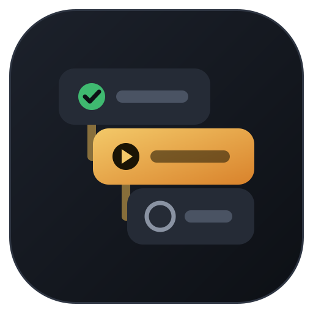
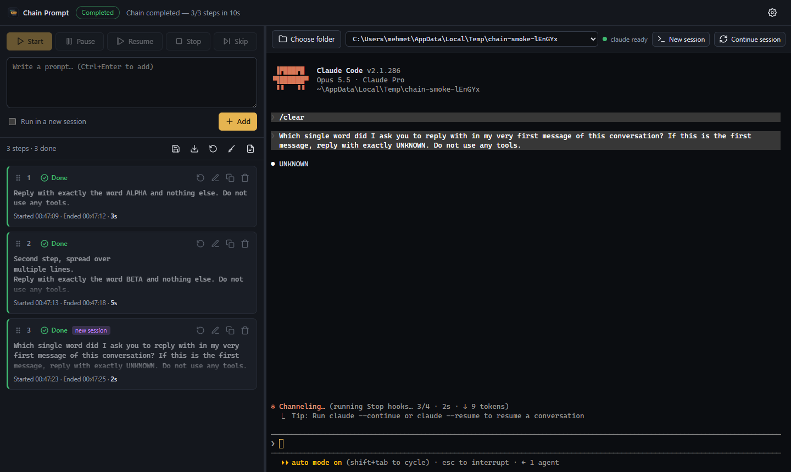
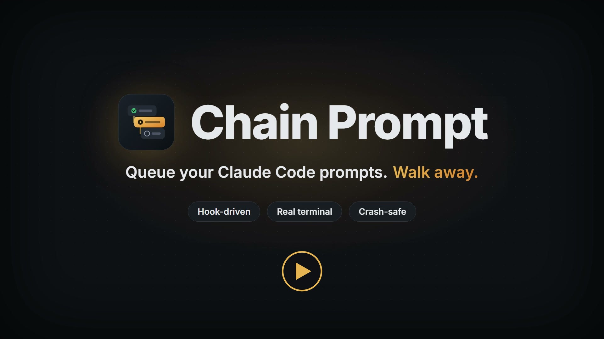
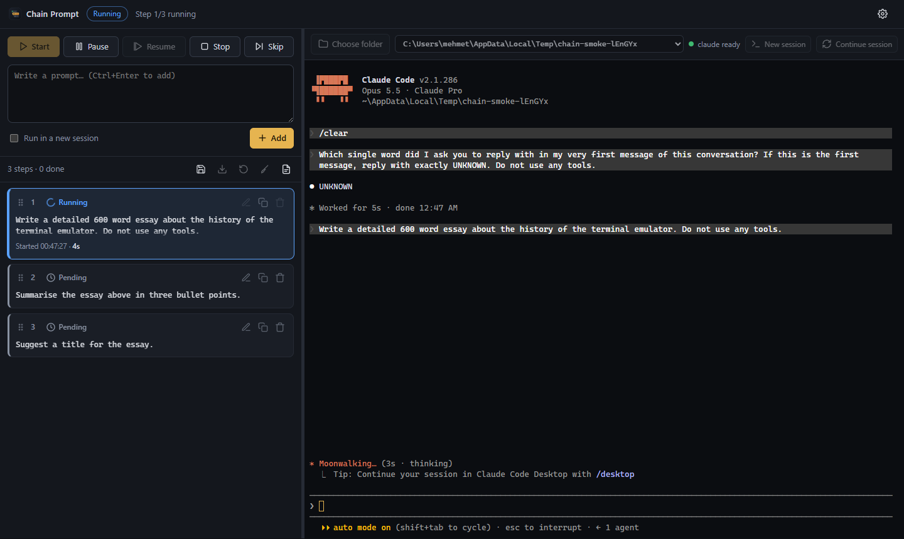
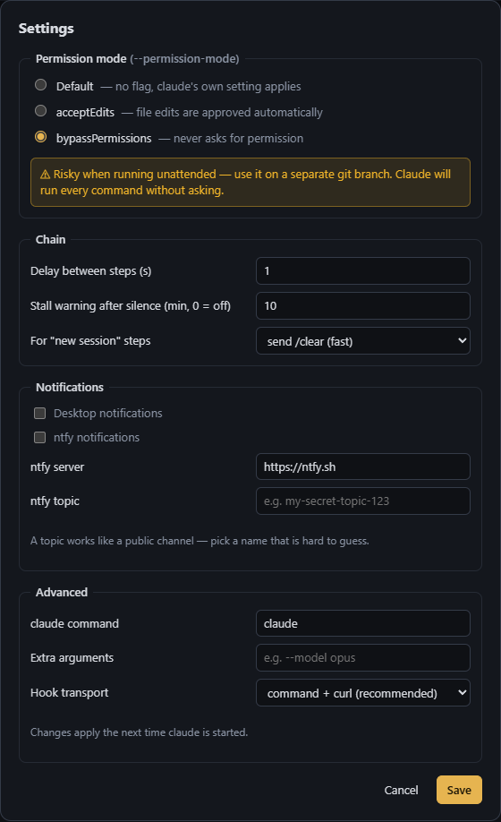
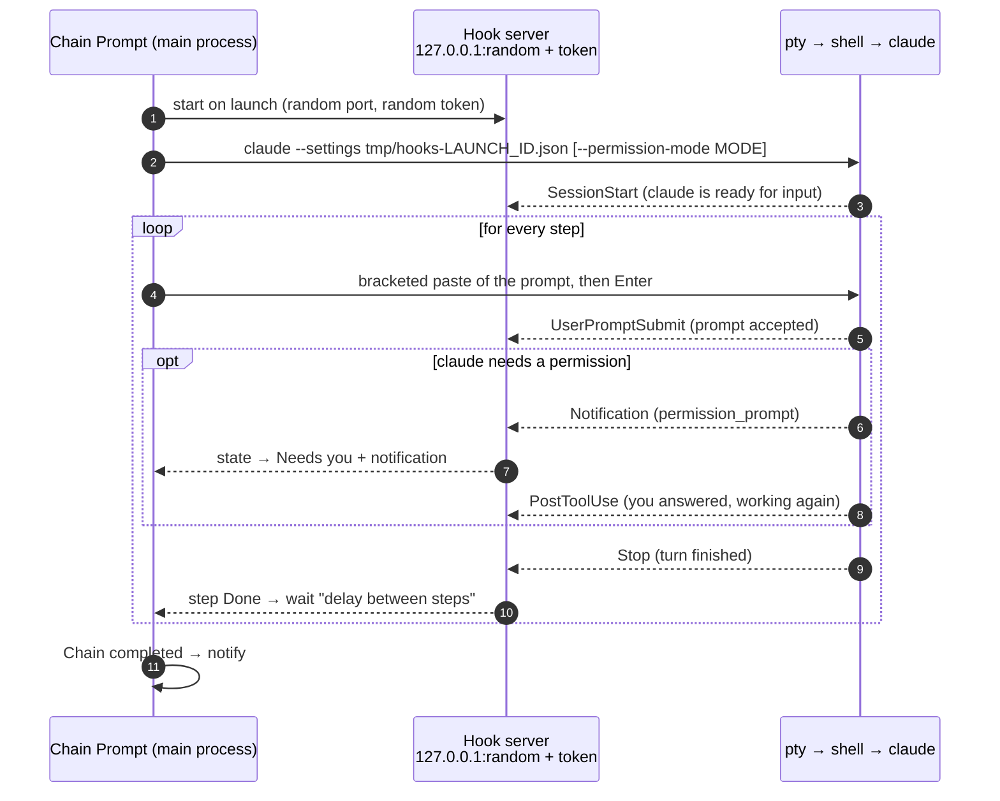
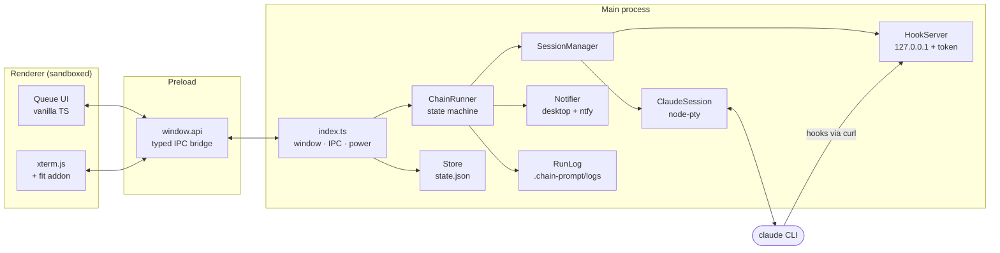
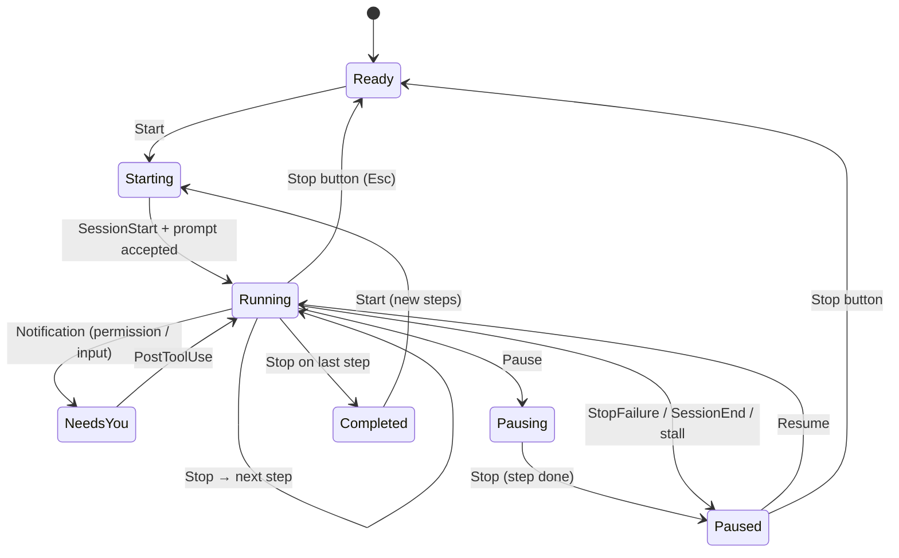

<div align="center">



# Chain Prompt

**Queue up a series of prompts for Claude Code and walk away.**
Chain Prompt feeds each prompt into the same interactive `claude` session the moment the previous one finishes.
It detects completion through Claude Code hooks, not by parsing terminal output.


<br />


<br />



**▶ [Watch the 28-second promo](#promo-video)**

</div>

---

## Contents

- [Why](#why)
- [Features](#features)
- [Promo video](#promo-video)
- [Screenshots](#screenshots)
- [Quick start](#quick-start)
- [Usage](#usage)
- [Chain files (templates)](#chain-files-templates)
- [Settings](#settings)
- [Notifications, sleep and logs](#notifications-sleep-and-logs)
- [How step completion is detected](#how-step-completion-is-detected)
- [Architecture](#architecture)
- [Cross-platform notes](#cross-platform-notes)
- [Testing](#testing)
- [Troubleshooting](#troubleshooting)
- [Known limitations](#known-limitations)
- [Scripts reference](#scripts-reference)

## Why

Long Claude Code tasks often come as a sequence: *plan → implement → run tests → review → changelog*. Without
automation you have to sit at the terminal and type the next prompt each time a turn ends. Chain Prompt lets you
queue the whole sequence at once and go do something else. You get a notification when the chain finishes, when
claude needs a permission, or when something goes wrong.

It runs the real interactive `claude` inside a real pseudo-terminal, so you can watch, scroll, and type into the
session at any time, exactly as in your own terminal.

## Features

| | Feature | Details |
|---|---|---|
| 🔗 | **Hook-driven chaining** | Claude Code's `Stop` hook marks a step done. The next prompt is typed into the same session automatically. No screen scraping. |
| 🖥️ | **Real terminal** | xterm.js + node-pty running the interactive `claude`. Type in it, copy/paste, and it resizes with the panel. |
| 📋 | **Prompt queue** | Multi-line prompts, drag-and-drop reordering, edit, duplicate, delete, reset. Status is shown by colour and icon. |
| ⏯️ | **Full control** | Start, Pause (after the current step), Resume, Stop (interrupts claude with Esc), Skip next. |
| 🙋 | **Waits for you** | Permission prompts and input requests (`Notification` hook) switch the chain to *Needs you* and notify you. |
| 🧹 | **Fresh context per step** | Optional *new session* per step, via `/clear` or a full claude restart. |
| 🔐 | **Permission modes** | Default, `acceptEdits`, or `bypassPermissions` (with a risk warning), passed as `--permission-mode`. |
| 💾 | **Templates** | Save and load chains as JSON. The last queue is persisted automatically. |
| 🛟 | **Crash-safe** | Close the app mid-step and the step reopens as *Interrupted*. Press Start to resume from it. |
| 🚨 | **Auto-pause on trouble** | API errors (`StopFailure`), claude exiting, a prompt claude never accepted, or a stall (no output for N minutes) all pause the chain and point at the step. |
| 🔔 | **Notifications** | Desktop notifications plus optional [ntfy](https://ntfy.sh) push to your phone. |
| ☕ | **Stays awake** | `powerSaveBlocker` prevents system sleep while a chain is active. |
| 📝 | **Run logs** | Per-run `.log` and `.json` files with timings and claude's last message for every step, in `<folder>/.chain-prompt/logs/`. |
| 📁 | **Recent folders** | Native folder picker plus a dropdown of the last 10 folders. Switching folders starts a fresh session. |

## Promo video

<div align="center">

<a href="docs/promo/chain-prompt-promo.mp4">
  
</a>

**▶ Click the image to play** · 28 s · with sound

| Version | Resolution | Size |
|---|---|---|
| [chain-prompt-promo.mp4](docs/promo/chain-prompt-promo.mp4) | 1920 × 1080 | 8.4 MB |
| [chain-prompt-promo-4k.mp4](docs/promo/chain-prompt-promo-4k.mp4) | 3840 × 2160 | 17.9 MB |

</div>

A short tour: the manual prompt-and-wait loop, the queue running itself, the hook mechanism, the real app and
its main features. Every cut and animation lands on the beat of an original, bass-heavy soundtrack made for
this film.

## Screenshots

<table>
  <tr>
    <td width="62%"></td>
    <td width="38%"></td>
  </tr>
  <tr>
    <td align="center"><sub>A chain in progress: the running step is highlighted with a live timer</sub></td>
    <td align="center"><sub>Settings, with the <code>bypassPermissions</code> risk warning</sub></td>
  </tr>
</table>

> All screenshots are generated by the end-to-end test (`npm run test:e2e`) against a real claude session.

## Quick start

### Requirements

| Requirement | Notes |
|---|---|
| **Node.js ≥ 20** | Developed on Node 24 / npm 11. |
| **Claude Code CLI** | `claude` on your `PATH`, logged in. [Install guide](https://code.claude.com/docs). |
| **curl** | Used by the hooks. Ships with Windows 10+, macOS and most Linux distros. |
| Linux only | `python3`, `make`, `g++` to compile node-pty (Windows and macOS use prebuilt binaries). |

### Install and run

```bash
cd chain-prompt
npm install
npm run dev          # development mode with hot reload
```

### Package

```bash
npm run build        # typecheck + compile + electron-builder  ->  release/
npm run build:dir    # unpacked app only (faster, no installer)
```

| Platform | Output |
|---|---|
| Windows | `release/Chain Prompt Setup <version>.exe` (NSIS) |
| macOS | `release/Chain Prompt-<version>.dmg` |
| Linux | `release/Chain Prompt-<version>.AppImage` |

> [!NOTE]
> npm 11 only runs install scripts for approved packages. `electron`, `esbuild` and `node-pty` are already
> approved in `package.json` (`allowScripts`). If npm resolves a different version, run
> `npm approve-scripts <package>`.

## Usage

1. **Choose a folder**: click **Choose folder** (top right) or pick one from the recent-folders dropdown.
   `claude` starts in that folder in the embedded terminal.
   - **New session** restarts claude from scratch. **Continue session** starts `claude --continue`.
2. **Add prompts**: type into the composer and press **Add** (or <kbd>Ctrl</kbd>+<kbd>Enter</kbd>). Tick
   **Run in a new session** to reset the context before that step.
3. **Arrange**: drag cards by their grip (⋮⋮) to reorder. Hover a card to edit ✎, duplicate ⧉, delete 🗑, or reset ↺.
4. **Start**: the chain sends step 1, waits for claude to finish, then sends step 2, and so on.
   If no claude session is running, one is opened automatically.
5. **Walk away**: you are notified when the chain completes, when claude needs you, or when a step fails.

### Controls

| Button | What it does |
|---|---|
| ▶ **Start** | Runs the first pending, interrupted or failed step and continues down the queue. |
| ⏸ **Pause** | Lets the current step finish, then holds. During start-up it pauses immediately and nothing is sent. |
| ⏯ **Resume** | Continues from where the chain stopped. A failed step is retried. |
| ⏹ **Stop** | Sends <kbd>Esc</kbd> to interrupt claude's current turn and marks the step *Interrupted*. |
| ⏭ **Skip** | Marks the next pending step as *Skipped*. It is also allowed while a step is running. |

### Step statuses

| Status | Colour | Meaning |
|---|---|---|
| ◷ **Pending** | grey | Waiting its turn. |
| ◌ **Running** | blue (spinning) | The prompt has been sent and claude is working. A live timer is shown. |
| 🔔 **Needs you** | amber (ringing) | claude asked for a permission or input. Answer in the terminal and the chain carries on. |
| ✓ **Done** | green | The `Stop` hook arrived. Start/end time and duration are shown. |
| ✕ **Error** | red | API error, claude exited, or the prompt was never accepted. The reason is shown on the card. |
| ⏵ **Skipped** | slate | Skipped by you. |
| ⏸ **Interrupted** | purple | Stopped by you, or the app was closed while the step ran. |

### Terminal shortcuts

| Keys | Action |
|---|---|
| <kbd>Ctrl</kbd>+<kbd>C</kbd> | Copy the selection if there is one, otherwise send SIGINT as usual. |
| <kbd>Ctrl</kbd>+<kbd>V</kbd> | Paste (bracketed paste, so multi-line text is not submitted early). |

## Chain files (templates)

Use **Save** and **Load** (in the queue toolbar) to keep reusable chains as JSON:

```json
{
  "format": "chain-prompt",
  "version": 1,
  "name": "feature-workflow",
  "steps": [
    { "prompt": "Write an implementation plan for TODO.md to PLAN.md. Do not change code yet." },
    { "prompt": "Implement PLAN.md. Do not ask questions; make reasonable assumptions." },
    { "prompt": "Run the tests and fix anything you broke." },
    { "prompt": "Review this session's diff with fresh eyes and fix what you find.", "newSession": true },
    { "prompt": "Write a concise CHANGELOG entry for the work above." }
  ]
}
```

| Field | Type | Required | Description |
|---|---|---|---|
| `format` | `"chain-prompt"` | no | Identifies the file. |
| `version` | `1` | no | File format version. |
| `name` | string | no | Display name. The file name is used when saving. |
| `steps[].prompt` | string | **yes** | The prompt text. Multi-line text is fine. |
| `steps[].newSession` | boolean | no | Reset the context before this step. |

A bare array of strings (`["first prompt", "second prompt"]`) also loads. A ready-to-use template is available at
[`examples/feature-workflow.chain.json`](examples/feature-workflow.chain.json).

The current queue and each step's status are also saved automatically to `<userData>/state.json`, so they
survive restarts.

## Settings

Open with the ⚙ button in the top-right corner. Changes apply the next time claude is started.

| Setting | Default | Description |
|---|---|---|
| **Permission mode** | Default | `Default` passes no flag (claude's own configuration applies). `acceptEdits` auto-approves file edits. `bypassPermissions` never asks. Passed as `claude --permission-mode <mode>`. |
| **Delay between steps** | 2 s | Pause between the `Stop` hook and typing the next prompt. |
| **Stall warning** | 10 min | If a running step prints nothing for this long, the chain pauses and notifies you. `0` disables it. |
| **For "new session" steps** | `/clear` | Either send `/clear` (fast) or restart claude. |
| **Desktop notifications** | on | Native OS notifications. |
| **ntfy notifications** | off | Push notifications via an ntfy server and topic. |
| **ntfy server / topic** | `https://ntfy.sh` / – | Use a topic name that is hard to guess, or your own server. |
| **claude command** | `claude` | Path or name of the CLI. |
| **Extra arguments** | – | Appended to every launch, e.g. `--model opus`. |
| **Hook transport** | command + curl | Or native HTTP hooks. See [below](#hook-transport). |

> [!WARNING]
> **`bypassPermissions` is risky when running unattended.** Claude will run every command without asking.
> Use it on a separate git branch, ideally in a disposable environment.

## Notifications, sleep and logs

**You are notified when**

| Event | Desktop | ntfy priority |
|---|---|---|
| Chain completed | ✅ | default |
| claude needs a permission or input | ✅ | high |
| A step failed (API error, claude exited, prompt not accepted) | ✅ | high |
| A step seems stuck (stall warning) | ✅ | high |
| claude is waiting for a folder-trust or login confirmation at start-up | ✅ | high |

**Sleep prevention:** while a chain is running, waiting, or paused, Electron's
`powerSaveBlocker('prevent-app-suspension')` keeps the machine awake. It is released when the chain completes
or is stopped.

**Run logs:** every chain run writes two files to `<folder>/.chain-prompt/logs/`. A `.gitignore` is created
there so logs never end up in your repository. The **Logs** button opens the folder.

| File | Content |
|---|---|
| `YYYY-MM-DD_HH-MM-SS.log` | Human-readable event log: each prompt, acceptance, completion with duration, claude's last message, notifications, errors. |
| `YYYY-MM-DD_HH-MM-SS.json` | Machine-readable summary: per-step status, `startedAt`, `endedAt`, `durationMs`, note. |

<details>
<summary>Sample <code>.log</code> (real output from <code>npm run test:chain</code>)</summary>

```text
[2026-09-30T21:47:42.908Z] Chain started — folder: C:\Users\me\AppData\Local\Temp\chain-smoke-MYsPot
[2026-09-30T21:47:46.729Z] Step 1/3 started — prompt:
    Reply with exactly the word ALPHA and nothing else. Do not use any tools.
[2026-09-30T21:47:47.267Z] Step 1/3: prompt accepted by claude
[2026-09-30T21:47:49.027Z] Step 1/3 done (2s)
[2026-09-30T21:47:49.027Z]   Claude last message:
    ALPHA
[2026-09-30T21:47:50.031Z] Step 2/3 started — prompt:
    This prompt has several lines.
    Line two.
    Line three: reply with exactly the word BETA and nothing else. Do not use any tools.
[2026-09-30T21:47:50.528Z] Step 2/3: prompt accepted by claude
[2026-09-30T21:47:54.309Z] Step 2/3 done (4s)
[2026-09-30T21:47:54.309Z]   Claude last message:
    BETA
[2026-09-30T21:47:55.314Z] Step 3/3: sending /clear
[2026-09-30T21:47:58.915Z] Step 3/3 started (new session) — prompt:
    Which single word did I ask you to reply with in my very first message of this conversation? ...
[2026-09-30T21:47:59.473Z] Step 3/3: prompt accepted by claude
[2026-09-30T21:48:01.224Z] Step 3/3 done (2s)
[2026-09-30T21:48:01.224Z]   Claude last message:
    UNKNOWN
[2026-09-30T21:48:01.225Z] Chain completed — 3/3 steps in 9s
```

Step 3 answered `UNKNOWN`, which proves `/clear` really reset the context.

</details>

## How step completion is detected

Chain Prompt never guesses from terminal output. Instead, every claude launch gets a temporary settings file
whose hooks report back to a small local server inside the app.



### The hooks

| Hook | Used for |
|---|---|
| `SessionStart` | claude is ready for input (`source: startup`, or `clear` after `/clear`). The first prompt is only sent after this. |
| `UserPromptSubmit` | Confirms the prompt was accepted. If it does not arrive within 8 s, Enter is sent once more. If it still does not arrive, the step fails with a clear message. |
| **`Stop`** | **The step is done.** After a short delay, the next prompt is typed. |
| `StopFailure` | The turn ended on an API error (rate limit, auth, billing, …). The step fails and the chain pauses. |
| `Notification` | `permission_prompt`, `idle_prompt`, `elicitation_dialog`, `agent_needs_input` switch the chain to *Needs you* and notify you. |
| `PostToolUse` | claude is working again after you answered a permission prompt. |
| `SessionEnd` | claude exited. If a step was in flight, it fails and the chain pauses. |

<details>
<summary>What the generated settings file looks like</summary>

```json
{
  "hooks": {
    "Stop": [
      {
        "hooks": [
          {
            "type": "command",
            "command": "curl -s -m 5 -X POST -H \"content-type: application/json\" -H \"x-chain-prompt-token: <token>\" --data-binary \"@-\" \"http://127.0.0.1:<port>/hook/<launchId>/Stop\"",
            "timeout": 10
          }
        ]
      }
    ]
  }
}
```

The same entry exists for each hook in the table. Claude Code writes the hook's JSON input to stdin, and curl
forwards it as the request body.

</details>

### Safety and isolation

| Concern | How it is handled |
|---|---|
| Your own Claude settings | Never modified. Hooks passed with `--settings` are **merged** with your user and project hooks; they do not replace them. |
| Settings file | Written to the OS temp dir (`<tmp>/chain-prompt/hooks-<launchId>.json`, mode `0600`) and deleted when the session ends. |
| Local server | Binds to `127.0.0.1` only, on a random port. Every request must carry a random per-run token (constant-time compare), otherwise it gets `403`. |
| Stale events | Each claude launch has its own `launchId` in the hook URL. Late events from a killed session are ignored. |
| Stale `Stop` | A `Stop` that arrives before our prompt was accepted (`UserPromptSubmit`) belongs to an earlier turn and is ignored. |
| Multi-line prompts | Sent with bracketed paste (`ESC[200~ … ESC[201~`), so embedded newlines don't submit early. |
| Nested sessions | If the app is started from inside a Claude Code session, its `CLAUDECODE` / `CLAUDE_CODE_*` markers are stripped from the child environment. |
| Renderer | `contextIsolation: true`, `sandbox: true`, `nodeIntegration: false`, a strict CSP, a narrow typed preload API, and navigation and popups blocked. |

### Hook transport

| Transport | How | When to use |
|---|---|---|
| **command + curl** (default) | `type: "command"` hooks that pipe stdin to `curl` | Works for every hook event. |
| native HTTP | `type: "http"` hooks POST directly | Fewer processes, but Claude Code does **not** support HTTP hooks for `SessionStart` (`--debug` prints *"HTTP hooks are not supported for SessionStart"*), so `SessionStart` and `SessionEnd` always fall back to curl. It is also blocked if your settings define an `allowedHttpHookUrls` list that doesn't match. |

### Verified against the CLI

These details were checked with `claude --help`, `--debug-file` and the [hooks reference](https://code.claude.com/docs/en/hooks), not assumed:

| Fact | Consequence in the app |
|---|---|
| `--settings <file-or-json>` accepts a path or a JSON string | A per-launch file is used, which avoids shell quoting of JSON. |
| `--permission-mode` choices: `acceptEdits, auto, bypassPermissions, manual, dontAsk, plan` | *Default* passes no flag at all. |
| Hooks from `--settings` merge with other settings levels | Your hooks keep working next to ours. |
| A new folder first shows **"Do you trust this folder?"**, defaulting to *No, exit*, and `SessionStart` only fires after you confirm | The app never answers it for you. It waits, and after 20 s tells you to confirm in the terminal. The chain then starts by itself. |
| `/clear` fires `SessionEnd` followed by `SessionStart` with `source: clear` | This is used to know when the fresh context is ready. |

## Architecture



```
src/
├─ shared/             types, IPC channel names, preload API contract
├─ main/
│  ├─ index.ts         window, IPC handlers, persistence, powerSaveBlocker
│  ├─ store.ts         <userData>/state.json (debounced, atomic writes)
│  ├─ notifier.ts      desktop + ntfy notifications
│  └─ core/            Electron-free core, testable with plain Node
│     ├─ hookServer.ts       token-protected loopback HTTP server
│     ├─ claudeSettings.ts   temporary --settings file with the hooks
│     ├─ ptySession.ts       node-pty, per-OS shell, claude arguments
│     ├─ sessionManager.ts   launches claude, readiness, launchId filtering
│     ├─ chainRunner.ts      the chain state machine
│     └─ runLog.ts           .chain-prompt/logs writer
├─ preload/index.ts    contextBridge API
└─ renderer/           UI (vanilla TypeScript) + xterm.js
scripts/               unit, real-claude and e2e tests, icon renderer
examples/              ready-to-load chain templates
docs/                  logo and screenshots used in this README
```

### Chain state machine



## Cross-platform notes

| | Windows | macOS | Linux |
|---|---|---|---|
| Shell used | `powershell.exe -NoExit -Command & 'claude' …` | `$SHELL -i -l -c "claude …; exec $SHELL -i -l"` (zsh by default) | same as macOS (bash by default) |
| Why | Resolves `claude.exe`, `.cmd` or `.ps1` | Loads `.zshrc` / `.bashrc` / `.profile`, where `claude` is usually added to `PATH` | same |
| curl in hooks | `curl.exe` (avoids PowerShell's `curl` alias) | `curl` | `curl` |
| node-pty | prebuilt (ConPTY) | prebuilt | compiled on install |
| Installer | NSIS | DMG | AppImage |

When claude exits, the terminal drops into the shell, so the terminal stays usable.

## Testing

```bash
npm test                                   # typecheck + state-machine unit tests (no claude needed)
npm run test:chain                         # real claude, 3-step chain, no Electron
npm run test:e2e -- <trusted-folder>       # drives the real Electron app with Playwright
```

| Suite | Needs claude | What it proves |
|---|---|---|
| `test:unit` | no | 30 checks: chaining on `Stop`, ignoring stale `Stop`, permission → *Needs you* → back to running, pause/resume, stop (Esc), skip, `StopFailure`, `SessionEnd`, stall auto-pause, restore as *Interrupted*, reorder and duplicate. |
| `test:chain` | yes | Every `Stop` hook triggers the next prompt, a multi-line prompt arrives intact, steps run strictly in order, logs are written, and `/clear` really resets the context (step 3 answers `UNKNOWN`). |
| `test:e2e` | yes | Adds 3 prompts through the UI, runs them, checks all cards are *Done* and the terminal shows the reply, captures the README screenshots, then quits mid-step, relaunches, and checks the step is *Interrupted*. |

> [!TIP]
> `test:e2e` needs a folder claude already trusts (run `claude` there once), because the app never answers the
> trust dialog on your behalf. Only `test:chain` auto-accepts it, for its own throwaway temp folder.

## Troubleshooting

| Symptom | Likely cause | Fix |
|---|---|---|
| Stuck on *Starting*, "No ready signal (SessionStart)…" | claude is showing the folder-trust dialog or a login prompt. | Answer it in the terminal; the chain starts by itself. |
| "The prompt was not accepted by claude (no UserPromptSubmit hook)" | Hooks are not reaching the app: curl is missing, hooks are disabled (`disableAllHooks`), or `allowedHttpHookUrls` blocks HTTP hooks. | Check `curl --version`, check your Claude settings, and try the other **Hook transport**. Run with `--debug-file` in *Extra arguments* to see hook errors. |
| Chain paused with "may be stuck" | No terminal output for the stall timeout. | Look at the terminal. **Resume** keeps waiting for the same step. A later `Stop` still marks it done. |
| `claude: command not found` in the terminal | `claude` isn't on the `PATH` of the shell the app starts. | Set the full path in **Settings → claude command**. |
| Step marked *Error* right after you typed `/clear` by hand | `/clear` ends the session (`SessionEnd`) while a step is running. | Don't run `/clear` manually during a step; use the step's *new session* option. |
| No ntfy push | ntfy disabled or topic empty. | Enable ntfy and set a topic in Settings. |
| `npm install` skipped Electron or node-pty setup | npm 11 blocks unapproved install scripts. | `npm approve-scripts electron esbuild node-pty`, then `npm rebuild`. |

## Known limitations

- If claude asks *you* a question and ends its turn, that is a `Stop` too, so the next prompt is sent. For
  unattended chains, tell claude in the prompt not to ask questions and to make reasonable assumptions.
- Only one claude session (one folder) is driven at a time.
- ntfy topics on the public server are readable by anyone who knows the name.

## Scripts reference

| Script | Description |
|---|---|
| `npm run dev` | Start the app with hot reload (electron-vite). |
| `npm start` | Preview the production build. |
| `npm run build` | Typecheck, compile and package with electron-builder into `release/`. |
| `npm run build:dir` | Compile and produce an unpacked app (no installer). |
| `npm run typecheck` | `tsc --noEmit` for the main/preload and renderer projects. |
| `npm test` | Typecheck + unit tests. |
| `npm run test:unit` | State-machine tests with a fake claude session. |
| `npm run test:chain` | Real-claude 3-step chain test (Electron-free). |
| `npm run test:e2e -- <folder>` | Playwright end-to-end test of the built app; regenerates `docs/*.png`. |
| `npm run icon` | Render `docs/logo.svg` to `build/icon.png` (the app icon). |
